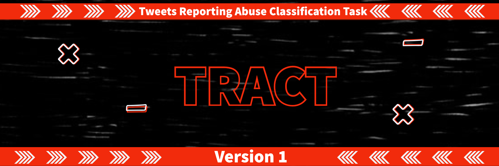

# **Tweets Reporting Abuse Classification Task** 

The total number of users of social media continues to grow worldwide, resulting in the generation of vast amounts of data. Popular social networking sites such as Facebook, Twitter and Instagram dominate this sphere. According to estimates, 500 million tweets and 4.3 billion Facebook messages are posted every day. According to the latest Pew Research Report, nearly half of adults worldwide and two-thirds of all American adults (65%) use social networking.


In recent decades we have noticed a considerable increase in reports or confession posts of abuse victims on twitter. Most of the time victims do not report it to their guardians or the concerned authorities. Teenagers and minorities are the most affected group of abuse. Part of these victims tweets about their incident to let go of pain and suffering or as a cry for help. Identifying such reports are challenging because of the unavailability of annotated training data, and a high degree of data sparsity. To address this we are hosting TRACT in **[DSC OMG](https://dscomg.com/)** A.K.A Online Mega Gathering. 

* We release the first small scale manually annotated corpus for abuse classification problem
* Propose a shared task for this problem **TRACT**

## Task
This new, multi-class classification task involves distinguishing three classes of tweets that mention abuse reportings: "report" (annotated as 1);  "empathy" (annotated as 2);  and   "general" (annotated as 3) 

1. Automatic classification of tweets reporting abuse
    * F1-score for each class
    * Micro Averaged F1 scores

2. Exploratory Analysis
### Important dates
* Registration deadline : 23 June
* Training and Validation data release : 11 June 
* Test data release : 26 June
* Predicion submission : 28 June
* Leaderboard release: 30 June
* System description paper submission : 1 July

### Data
* **Training data** : contains 3000 tweets (37 report, 80 empathy, 2883 general)
* **Validation data** : contains 1500 tweets (19 report, 36 empathy, 1445 general)
* **Test data** : blind dataset

### Evaluation metrics
F1 metrics are considered for evaluation of systems

### Registration
for registration [click here](https://forms.gle/SwDTbcMnPAv1FQWu9)

### Submission Guidelines

#### optional
* Short paper(upto 4 pages) of system and results
* [Instructions for authors](https://Saichethan.github.io/TRACT/ioa)
* Latex Template [Arxiv Preprint](https://github.com/Saichethan/TRACT/blob/master/Style%20and%20Template%20for%20Preprints%20(arXiv%2C%20bio-arXiv).zip)


### Organizers
1. **Saichethan M. Reddy**
2. **Kanishk Tyagi**

### Contact
for more information regarding shared task contact [organizer](mailto:saichethanreddymiriyala@gmail.com)


## References

* Miriyala Reddy, Saichethan; Tyagi, Kanishk ; Anand Tripathi, Abhay; Deoli, Rajat (2020), “TRACT: Tweets Reporting Abuse Classification Task Corpus”, Mendeley Data, V1, [doi: 10.17632/my2vkfyffd.1](http://dx.doi.org/10.17632/my2vkfyffd.1)

```
@misc{https://doi.org/10.17632/my2vkfyffd.1,
  doi = {10.17632/MY2VKFYFFD.1},
  url = {https://data.mendeley.com/datasets/my2vkfyffd/1},
  author = {Miriyala Reddy, Saichethan},
  keywords = {Data Mining, Social Media, Domestic Abuse, Twitter},
  title = {TRACT: Tweets Reporting Abuse Classification Task Corpus},
  publisher = {Mendeley},
  year = {2020}
}
```


